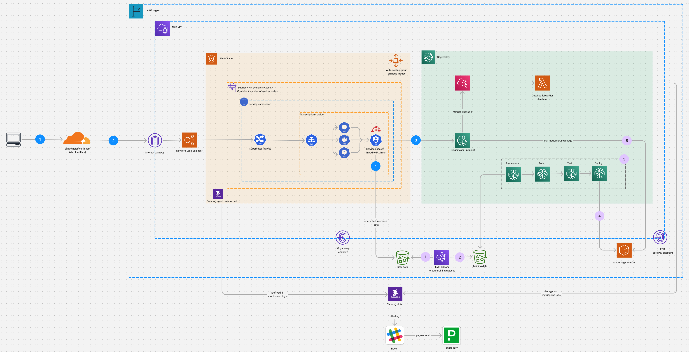

# ML Infra - Transcription Model

## Infrastructure design for Transcription Model

## Sample implementation
I have added a sample implementation of the some of the key networking components, the sample implementation includes.
  - Cloudflare proxy 
  - Internet gateway
  - VPC
  - load balancer
  - EKS node groups

## Explanation 

### Networking Decisions

### Security decisions 

### Monitoring 

